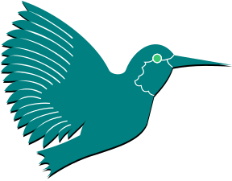

### Hi everyone

My name is Gabriel.
I'm currently learning about quantum programming.

<!--
**G-Carneiro/G-Carneiro** is a ✨ _special_ ✨ repository because its `README.md` (this file) appears on your GitHub profile.

Here are some ideas to get you started:

- 🔭 I’m currently working on ...
- 🌱 I’m currently learning ...
- 👯 I’m looking to collaborate on ...
- 🤔 I’m looking for help with ...
- 💬 Ask me about ...
- 📫 How to reach me: ...
- 😄 Pronouns: ...
- ⚡ Fun fact: ...
-->

  <a href="https://github.com/G-Carneiro">
  
  

  
 

  
  

  
  ---
  

 
   
  
   
 

